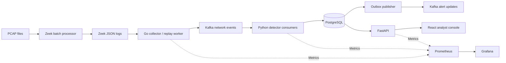

# TraceHawk project plan

Date: October 3, 2026  
Workspace root: `/Users/dinesh/TraceHawk`  
Status: Phases 0–3 completed locally; see `docs/phase-3/README.md` for two-consumer recovery, alert/dead-letter delivery, backpressure, probes and Grafana verification.  
Target: A demonstrable network security product and defensible engineering evidence for the supplied Palo Alto Networks master's-graduate software engineering role.

## 1. Product definition

TraceHawk converts network telemetry into explainable security alerts. An analyst can replay traffic, inspect suspicious hosts, investigate the evidence behind a detection, and record a disposition. An engineer can inspect pipeline health and demonstrate recovery after a processing failure.

Example: a host attempts connections to many ports on a server. TraceHawk aggregates these events, identifies possible scanning, and presents the source, target, ports, timestamps, threshold, and rule version. An alert indicates suspicious behavior, not a confirmed compromise.

The application has three equally important deliverables:

1. A working detection pipeline with documented network semantics.
2. Correct, measurable processing and recovery behavior.
3. A polished console and repeatable demonstration suitable for a short video.

The product should complement SentinelLLM: SentinelLLM provides AI application security; TraceHawk provides network security and streaming detection. Infrastructure technologies can overlap, but project accomplishments should emphasize different problems.

## 2. Scope and milestones

### Required for the first complete release

- PCAP processing through containerized Zeek and ingestion of Zeek JSON logs.
- Go collector with schema validation, source checkpoints, bounded buffering, and Kafka publishing.
- Kafka-backed Python detection with explainable configurable rules.
- Vertical port scans, repeated failed TCP connections, suspicious DNS NXDOMAIN patterns, and exact known-indicator matches.
- PostgreSQL alert/evidence persistence and durable detection state.
- FastAPI investigation and management API.
- React/TypeScript analyst console with overview, alerts, investigations, host activity, rules, replay, and health.
- Local authenticated analyst/operator accounts and audited management changes.
- Repeatable scenarios, unit/integration/browser tests, public CI configuration, and measured evaluation reports.
- Prometheus metrics and provisioned Grafana operational dashboards.
- Docker Compose startup, readiness checks, reset procedures, and a five-minute demo script.

### Required for the portfolio release after the core application works

- Multi-consumer validation, rebalance/restart tests, and demonstrated backlog recovery.
- An opt-in anomaly-detection baseline, with an independent evaluation and comparison against rules.
- Tested local Kubernetes deployment and recovery runbook.
- Architecture decisions, dataset provenance, threat model, performance report, screenshots, video script, and evidence-based resume bullets.

### Deferred extensions

- Live traffic capture in a supported Linux environment.
- Authentication-log ingestion and evidence-based brute-force detection.
- Horizontal scanning across many destination hosts.
- Connection-rate spikes and unusual outbound destinations.
- Richer threat intelligence, rule-to-MITRE mappings, and additional protocol detectors.
- Cloud deployment and Terraform only if they add a concrete deployment outcome.

Automatic firewall blocking, custom packet parsing, Spark/Flink, a general SIEM, multi-region operation, arbitrary file uploads, and LLM alert summarization are outside the initial scope. Investigation and reliable detection are sufficient for a strong first release.

## 3. Architecture and technology decisions



| Component | Choice | Responsibility / reason |
|---|---|---|
| Network telemetry | Zeek | Protocol metadata from PCAP; avoids inventing a packet parser |
| Collector | Go, proposed franz-go client | Log normalization, replay pacing, Kafka publishing, graceful shutdown |
| Streaming broker | Apache Kafka in KRaft mode | Partitioned durable input, consumer groups, replay and backlog visibility |
| Detection | Python, proposed confluent-kafka client | Stateful rules, feature extraction, optional ML, measurable correctness |
| Persistence | PostgreSQL | Evidence, rules, alert lifecycle, processing state, checkpoints, outbox |
| API | FastAPI, Pydantic, SQLAlchemy/Alembic | Validated contracts, queries, migrations, management controls |
| Console | React, TypeScript, Vite | Analyst workflows and demo controls |
| Console updates | Bounded periodic polling initially | Simple reconnect behavior; SSE only if polling fails the experience target |
| Observability | Prometheus and Grafana | Processing health, lag, latency, saturation and failures |
| Tests | Go testing, pytest, Playwright | Collector, detector, end-to-end and browser evidence |
| Packaging | Docker Compose, then local kind Kubernetes | Reproducible local operation and a later deployment demonstration |
| CI | GitHub Actions | Build, lint, tests, migrations, image and integration validation |

Pin compatible stable releases and image digests during Phase 0 after verifying ARM64 support and license compatibility. These library choices are proposals until that compatibility check passes. Do not use floating `latest` tags.

Redis is omitted from the baseline. PostgreSQL provides durable state and avoids an additional checkpoint consistency problem. Reconsider only after profiling identifies a justified need.

A one-broker local profile demonstrates processing recovery, not broker high availability. A later multi-broker profile is optional and must have separately tested replication settings before any availability claim.

### Local profiles

- `core`: Kafka, PostgreSQL, collector/replay worker, detector, API and console.
- `telemetry`: one-shot Zeek PCAP processing job, isolated from the analyst API.
- `observability`: Prometheus and Grafana.
- `evaluation`: corpus replay, benchmark and failure-test tools.
- `kubernetes`: later deployment of the same images/configuration with documented local limitations.

Budget for a laptop with roughly 16 GiB host memory, subject to an actual preflight check. Set container memory/CPU limits, log rotation, broker retention, and database retention; measure usage rather than assuming all profiles fit. Stop unrelated development stacks when measuring.

## 4. Telemetry, identity and contracts

### Input modes

1. Small synthetic normalized fixtures for fast deterministic tests.
2. Zeek JSON fixtures for parser and protocol tests.
3. Controlled PCAP scenarios processed by the pinned Zeek image for genuine end-to-end evidence.
4. Optional attributed public captures/logs for broader evaluation, after provenance and label review.

Clearly label these input modes in the console and reports. Synthetic fixtures are not field validation. Preprocessed log playback exercises streaming detection; it does not reproduce packet-capture performance.

Initial logs: `conn.log` and `dns.log`. Preserve connection UID for cross-log investigation, but do not assume UID uniquely identifies every DNS query or is globally unique across sensors and runs.

### Normalized event envelope

Specify JSON Schema and checked-in examples before implementation. Required/common fields:

- `schema_version`, `event_id`, `event_kind` (`connection`, `dns`, or trusted replay control).
- `scope_id`, `sensor_id`, `source_generation_id`, optional `run_id`.
- `event_time`, `ingested_at`, `published_at`, `original_timestamp`, optional connection end time.
- Source/destination addresses and ports, protocol, Zeek UID, and log type.
- Typed connection/DNS details with unknown values preserved as null.
- Source provenance: source file generation, record byte offset, Zeek version and fixture/capture identifier.
- Optional internal Kafka topic/partition/offset attached on persistence, not supplied as trusted client identity.

Use UTC timestamps with defined precision. Validate IPs, port ranges, supported kinds, payload size, and field types. Avoid Python float timestamps for identity; preserve exact source representation or normalized integer time units.

Choose immutable source generation IDs. Derive event IDs from scope, sensor, source generation, log kind and record offset, not only content hashes: two legitimate identical records must remain separate events. Retries retain the same event ID. A fresh demo run gets a new run scope; recovery of an existing run retains its IDs.

Zeek connection `ts` represents the connection start, while a log record may become available much later. Phase 0 must settle the detector-time contract using actual fixtures: proposed connection event time is `ts + duration` when duration is known, with the original start preserved; DNS uses its documented transaction timestamp. Describe resulting latency and fallback limitations. Do not silently treat arrival time and packet time as interchangeable.

### Kafka topics

| Topic | Key | Contents |
|---|---|---|
| `tracehawk.events.v1` | scope + source IP | Normalized connection/DNS events and per-partition trusted replay controls |
| `tracehawk.alerts.v1` | alert ID | Versioned alert updates published from the database outbox |
| `tracehawk.deadletters.v1` | source/event identifier | Bounded invalid/unsupported record metadata, reason and provenance |

Start with three event partitions and a fixed partition count for each run. All initial stateful detectors group by originating host, sometimes with destination as a secondary grouping, so source-IP partitioning keeps their state local. New detectors requiring destination-wide aggregation need a repartitioned stream or another explicit design. A single busy source cannot be split across consumers without changing the state model.

Choose retention by disk budget and recovery needs. Record the replay horizon. Never silently skip ahead when required Kafka history has expired.

## 5. Detection specification

The values below are initial engineering defaults for scenarios, not validated universal security thresholds. Freeze and version them before held-out evaluation; tune only on development data.

| Detector | Grouping and initial behavior | Evidence and important benign cases |
|---|---|---|
| Vertical TCP scan | Source + destination; at least 20 distinct destination ports in a rolling 60-second window | Ports, connection states and counts; compare authorized scanner and broad legitimate administration |
| Repeated failed TCP connections | Source + destination; at least 20 attempts and at least 80% selected failure states in 60 seconds | State distribution and denominators; compare service outage and retries |
| DNS NXDOMAIN burst | Source; at least 30 completed DNS responses and at least 60% NXDOMAIN in 60 seconds | Queries, response codes, distinct names; compare misconfiguration and ordinary lookup errors |
| Known indicator | Exact destination IP or normalized DNS-name match against a local versioned list | Indicator source, match type and list version; match demonstrates an indicator hit, not confirmed malware |

Failure-state mapping must follow the pinned Zeek documentation. Start with explicit states such as no response/rejection, preserve other states, and document exactly which are counted. Exclude missing DNS response codes from completed-response denominators and report the missing count separately.

Normalize DNS names consistently (case and trailing dot); implement exact matching initially. Suffix/wildcard semantics need separate tests. Long/entropy-heavy names can be a later detector, with benign CDN names included in evaluation and a public-suffix strategy defined first.

TCP port activity alone cannot establish a failed login. Brute-force detection is deferred until reliable authentication records exist. Zeek SSH outcomes may be unavailable or inferred; unknown is not equivalent to failure.

### Windows and event-time behavior

- Rolling windows cover `[window_end - 60 seconds, window_end)` and advance every 10 event-time seconds.
- Use a documented partition watermark and a proposed 30-second lateness allowance; finalize only when the window end is behind the watermark.
- Persist events/state needed for not-yet-finalized windows. Deduplicate before feature counting.
- Already-finalized late events remain searchable and are counted as too late; the first release does not revise old finalized detections silently.
- In replay mode, historical time progresses independently of wall-clock playback speed. Merge logs by detector event time and use ordered per-partition completion controls to flush the final windows.
- In live mode, define idle-partition progression and clock-skew bounds separately before enabling capture. Heartbeats/completion controls must be emitted by a trusted producer, not arbitrary telemetry fields.
- Reject/quarantine implausible future timestamps before they can move watermarks; apply validation relative to declared replay bounds for historical runs.
- Display the 10-second evaluation cadence and lateness allowance in latency reporting. Detection may legitimately take tens of seconds of event time.

### Severity, explanations and grouping

Use explicit low/medium/high/critical mappings per rule, with limited documented escalation conditions. Store measured features, threshold values, rule version, evidence IDs, window boundaries and explanation template version. Severity is not a calibrated attack probability.

Group adjacent matching windows into a deterministic five-minute episode bucket per scope, rule version and entity. Update one alert's first/last times, maximum feature values and unique evidence references; do not sum overlapping windows. Bucket boundaries may produce separate episodes and must be visible/documented. Alert IDs are deterministic from these grouping fields. This is a simple, testable first policy; dynamic incident correlation is deferred.

### Rules and suppressions

- Immutable rule versions with schema validation and bounded window/threshold ranges.
- Scope each demo run to a rule snapshot for reproducible results.
- New configuration applies to new runs initially; hot changes to active detector state are deferred.
- Suppressions include entity/rule scope, reason, creator, creation time and expiry.
- Retain suppressed findings and evidence; hide by default in the inbox, allow inspection and report suppressed counts.
- Separate analyst disposition (`open`, `acknowledged`, `resolved`) from suppression and detector severity.

## 6. Persistence and processing correctness

Baseline tables: `runs`, `sensors`, `events`, `detector_state`, `partition_checkpoints`, `alerts`, `alert_evidence`, `alert_updates_outbox`, `rule_versions`, `suppressions`, `indicator_versions`, `users`, `sessions`, and `audit_events`.

Use migrations, uniqueness constraints, evidence foreign keys, bounded query pagination and indexes for scope/time/source/destination. Raw payloads are bounded and optional; prefer normalized metadata. Retain the full triggering event set for small scenarios, with an explicit evidence cap/truncation flag for larger workloads. Record retention expiry without leaving unexplained dangling evidence.

### Processing transaction

For each bounded batch within an owned Kafka partition:

1. Validate assignment ownership/fencing and lock the partition checkpoint.
2. Skip offsets already recorded as applied; verify forward offset progression without assuming Kafka offsets are numerically contiguous.
3. Insert unique events, update durable window state/watermarks, finalize eligible detections, upsert alerts/evidence, and insert outbox updates.
4. Persist the next Kafka offset and detector state in the same PostgreSQL transaction.
5. Commit the database transaction, then acknowledge the Kafka consumer position.

PostgreSQL is the authority for applied processing offsets. On assignment, load state and seek to the durable next offset. Database locking and ownership generation fencing prevent stale/revoked workers from updating state. Design the assignment/revocation protocol as an ADR before adding multiple consumers; test crash points around ownership changes. In-memory state is only a cache and must be discarded/reloaded after rollback or reassignment.

The outbox publisher may deliver an update more than once. Consumers deduplicate by update ID; the console reads authoritative persisted state. Scope the guarantee as at-least-once transport with idempotent durable effects for tested failures, not global exactly-once delivery.

Collector checkpoints advance only after Kafka acknowledgments. A crash after publish but before checkpoint can resend records; stable IDs make this safe. Handle partial JSON lines, truncation and rotation explicitly. Never advance past an unacknowledged earlier record just because a later publish finished.

Bound buffering and batches; pause consumption/publishing rather than silently dropping data. Database outage means no detector checkpoint advancement. Invalid records are recorded once and advance only after their dead-letter/outbox record is durable. Retry transient errors with bounded backoff; expose persistent failures in health.

Do not claim zero data loss outside acknowledged/persisted inputs, configured retention, or tested failure boundaries. Input capture loss is separate from detector recovery.

## 7. Analyst console and API

### Pages and workflows

1. **Overview:** recent traffic, active alerts by severity, suspicious hosts, sensor freshness, selected run and replay badge.
2. **Alerts:** sortable/filterable inbox; severity, source, target, detector, first/last activity, disposition and suppression.
3. **Alert detail:** plain-language explanation, thresholds vs observed values, evidence timeline/table, rule version, provenance, related host links and disposition history.
4. **Host detail:** inbound/outbound connections, ports, DNS activity and related alerts. Destination searches must work even though detection partitioning uses source IP.
5. **Rules:** view definitions and versions; operator creates a new validated version with change reason.
6. **Replay:** choose an allowlisted scenario, playback speed, start/cancel, progress, expected scenario description and results. Clearly label synthetic inputs.
7. **System health:** component readiness, event freshness, consumer lag, retries/dead letters and link to Grafana.

Use a restrained security-console design with readable tables, consistent severity colors, keyboard navigation, loading/empty/error states and responsive layouts. Avoid fabricated geography/topology. A lightweight source-to-target diagram is optional if it improves an investigation.

Proposed endpoints under `/api/v1`: session login/logout/me; overview; paginated alerts; alert detail/status; hosts/activity; events; rules/versions; suppressions; indicators; scenarios; replay runs/start/cancel; health. Define request/response schemas and authorization before coding. Use server-side filtering and stable cursor pagination.

Replay commands enqueue durable jobs; HTTP handlers do not spawn unrestricted shell commands. A single bounded worker executes allowlisted scenarios. Cancellation leaves a clearly marked partial run. Reset is an explicit local CLI operation scoped to demo resources; no unrestricted public destructive API.

### Security boundaries

- Browser reaches the API through a same-origin console proxy; Kafka/PostgreSQL remain private.
- Analyst can inspect and change alert disposition; operator can manage rules, suppressions and replay.
- Use generated local credentials, password hashes, expiring HttpOnly sessions, CSRF protection for mutations, and audit trails. Never commit credentials.
- Bound filters, payloads, result sizes and replay concurrency. Escape network-derived text in the console.
- Bind published local endpoints to loopback. TLS and broker authentication become required design work for any remote deployment.
- Demo fixtures are controlled captures/metadata. Keep application logs free of passwords, session tokens and packet payloads.

## 8. Optional ML baseline

Add only after rule features and evaluation are stable. Proposed baseline: Isolation Forest on per-host fixed-window features such as connection count, distinct destinations/ports, failed-connection ratio, outbound bytes and DNS NXDOMAIN ratio.

- Train on a labeled benign development subset; fit feature preprocessing only there.
- Version feature schema, artifact, training manifest and threshold.
- Select thresholds on development scenarios with a stated false-positive objective.
- Split by capture/session/host as appropriate, not random near-duplicate event rows.
- Evaluate once on a frozen held-out set and compare rules, ML and combined behavior.
- Explain anomalous feature deviations against baseline ranges; do not claim causal attribution or probabilities from an anomaly score.
- Missing-feature behavior and cold-start requirements must be explicit.
- ML is opt-in and loads only a packaged verified artifact. Do not expose arbitrary model-file upload or unsafe deserialization of untrusted artifacts.

Do not transplant a UNSW-NB15-trained model into Zeek inference without validating feature definitions and distributions. A dataset classifier and a deployed telemetry detector are separate claims.

## 9. Scenarios, tests and evaluation

### Scenario catalog

Each scenario has a manifest containing ID/version, provenance/license, capture or generator method, hashes, time bounds, addresses, ground-truth episodes, expected detector families and benign explanations. Ground-truth evaluation labels stay outside runtime detector input.

Required scenarios:

- Benign web/DNS traffic.
- TCP vertical scan.
- Repeated rejected/unanswered TCP attempts.
- DNS NXDOMAIN burst.
- Exact indicator match and benign non-match.
- Authorized scanner with an explicit suppression.
- Benign outage/retry burst to expose ambiguous failure rules.
- Boundary-threshold and boundary-window cases.
- Duplicate delivery and reordered events within allowed lateness.
- Events beyond lateness and implausible timestamps.
- Interrupted detector, database outage and consumer rebalance.

Use real Zeek-produced logs from small controlled captures for final detector demonstrations, alongside handcrafted edge-case fixtures. Maintain an unseen evaluation set with varied rates, host identities and benign activity. Do not generate every evaluation case directly from the same rule thresholds.

### Verification layers

| Layer | Required evidence |
|---|---|
| Contracts | Valid/invalid examples, Python/Go parity, schema-version behavior |
| Collector | Partial lines, rotation, truncation, acknowledgment ordering, backpressure, stable IDs |
| Detector unit tests | Boundaries, distinct counting, missing fields, temporal ordering, suppression, overlapping-window grouping |
| Integration | Real Kafka/PostgreSQL, migrations, restart/replay parity, checkpoint atomicity and outbox duplicates |
| Failure tests | Crash before/after DB commit, before Kafka acknowledgment, reassignment, broker/DB outage, expired retention |
| Browser tests | Authentication, filters, evidence links, status changes, replay progress, degraded/error states |
| End-to-end | PCAP -> pinned Zeek -> collector -> detector -> persisted alert -> console |

Do not substitute fake Kafka tests for recovery claims. Run fast tests on each change; run relevant integration checks before completing each phase. CI should run a small real-infrastructure suite with pinned resources.

### Metrics and reporting

- Detection: per-family episode precision/recall, benign alerts per host-hour where exposure is known, missed scenarios, suppression effects and matching tolerance.
- Separate event-level, window-level and episode-level metrics. Define ground-truth matching before evaluation.
- Latency: telemetry availability delay, event-time finalization delay, ingest-to-persist processing, persist-to-console display, p50/p95/p99 where sample counts justify them.
- Throughput: input attempted, Kafka acknowledged, detector applied and durable alert throughput separately.
- Recovery: downtime, backlog, catch-up time, final state parity, missing effects and duplicate alert/update counts.
- Resources: CPU, memory, disk growth, database batch/transaction timings and consumer lag.

Initial engineering targets, to validate rather than advertise as achievements: sustain 500 normalized events/sec for 10 minutes on the documented local core profile; p95 ingest-to-durable-processing under 2 seconds when no backlog exists; console reflects persisted alerts within 3 seconds. Window finalization delay is additional. Report actual results if targets are missed and profile before changing architecture.

Benchmark multiple source IPs and a hot single-source workload, one vs two consumers, with monitoring on/off noted. Use repeated runs, warm-up and complete workload/hardware/version descriptions. The throughput load generator is separate from the detection accuracy corpus.

## 10. Implementation phases and completion gates

### Phase 0: Specification and compatibility

Deliver: product brief, threat model, architecture diagram, version/dependency matrix, event/alert schemas, detector spec, wireframes, scenario manifests, and ADRs for event time, partitioning, persistence and local deployment.

Check Go/Python/Node/Docker availability, ARM64 images, memory/disk budget and port conflicts with SentinelLLM. Process a tiny PCAP through Zeek and inspect timestamp/state/DNS fields. Confirm client compatibility before pinning dependencies.

Gate: contracts validate; four detector definitions and unknown-field policies are explicit; local Zeek feasibility and resource budget are documented; designs support the demo flow.

### Phase 1: One complete vertical slice

Deliver: repository scaffold, Compose core, migrations, collector, Kafka, a Python consumer, one port-scan rule, persisted alert API, basic authenticated console, and start/reset helpers.

Use the durable transaction/checkpoint structure immediately, even with one consumer. Include unique evidence IDs and schema validation rather than replacing these later.

Gate: a clean checkout starts successfully; replay reaches an actual alert/evidence page; benign scenario stays quiet under the frozen baseline; restarting the same run does not duplicate persisted events/alerts.

### Phase 2: Detection and investigation

Deliver: four initial detectors, event-time finalization, deterministic alert grouping, host view, evidence timelines, indicator versions, rules and scoped suppressions, disposition/audit history.

Gate: threshold/window/reordering tests pass; every alert carries evidence and rule values; unknown outcomes remain unknown; suppressed results remain inspectable; UI filters return persisted results.

### Phase 3: Reliability and operations

Completed locally. Evidence: `docs/phase-3/recovery.json`, `delivery.json`, `backpressure.json`, `browser.json`, and the phase guide. Finalized detection/evidence/window state matches the uninterrupted controlled replay after rebalance/SIGKILL, PostgreSQL outage and Kafka outage. ACK-before-checkpoint publication produces two occurrences of one stable update ID; downstream deduplication retains the latest revision. Four worker scrape targets and ten Grafana panels are verified. This is a single-broker local recovery demonstration; load, accuracy and Kubernetes evaluation remain later phases.

Deliver: tested assignment fencing/state reload, two consumers, outbox alert topic, durable dead-letter handling, backpressure, readiness/liveness, structured logging, Prometheus metrics and Grafana dashboards.

Gate: crash/rebalance/database-outage tests yield the same final detection state as an uninterrupted reference run within the declared retention/lateness limits; outbox duplicates are identified; stale owners cannot write; health reports paused/degraded work accurately.

### Phase 4: Evaluation and ML

Deliver: frozen held-out corpus, attack/benign evaluation report, load and recovery reports, optional ML artifact/training/evaluation pipeline, documented misses and limitations.

Gate: all reported metrics regenerate from versioned inputs; evaluation labels never enter detectors; ML comparison uses consistent episode matching; observed weaknesses are retained in the report.

The rules-based release can proceed if the ML experiment does not improve useful detection. Preserve the experiment/report without default-enabling a weak detector.

### Phase 5: Deployment and hardening

Deliver: tested local Kubernetes manifests, same container images, probes, resource budgets, secrets/config handling, service/network boundaries, persistence and recovery instructions, clean-recreation test, required CI checks.

Gate: deploy, replay, restart and recreate procedures work as documented; data persistence boundaries are explicit; database/broker are not exposed publicly; Kubernetes claims match actual tests. Do not infer cloud experience from a local kind deployment.

### Phase 6: Presentation and portfolio release

Deliver: finished console states, bundled demo scenarios, reliable one-command setup and reset, README, screenshots, architecture/evaluation/runbook links, five-minute video script, recorded demonstration and two resume bullets grounded in measurements.

Gate: two consecutive clean demo rehearsals work; every button invokes working behavior; console clearly labels replay data; a reviewer can reproduce the main scenario from the README; claims match frozen evidence.

## 11. Repository structure

```text
/Users/dinesh/TraceHawk/
  PROJECT_PLAN.md
  README.md
  compose.yaml
  .github/workflows/
  contracts/                 # JSON Schemas, OpenAPI examples, parity checks
  services/
    collector/               # Go CLI/worker, normalization, replay, source checkpoints
    detector/                # Python consumer, windows, rules, state, optional ML
    api/                     # FastAPI, auth, queries, migrations, management
    console/                 # React UI and browser tests
  packages/                  # Small shared Python domain/contract helpers if necessary
  infrastructure/
    zeek/                    # Pinned processing image/scripts
    postgres/
    monitoring/              # Prometheus and provisioned Grafana
    kubernetes/
  scenarios/                 # Small fixtures, manifests and ground truth
  evaluation/                # Corpus tooling, reports, benchmark definitions
  tests/integration/
  tools/                     # Setup, doctor, replay, reset, benchmark, demo helpers
  docs/
    architecture.md
    threat-model.md
    detection-spec.md
    decisions/
    runbooks/
    demo-script.md
    evidence/
```

Large captures and generated reports/artifacts need explicit storage/versioning decisions; do not fill Git history with unbounded replay data. Credentials, local volumes and temporary captures are ignored. Keep migrations owned by one component and avoid duplicated schemas/business rules across services.

## 12. Demo and presentation plan

Proposed five-minute narrative:

| Time | Action | What it demonstrates |
|---|---|---|
| 0:00-0:35 | Explain the problem and show the overview with normal traffic | Product purpose and baseline |
| 0:35-1:25 | Start a port-scan replay and open the resulting alert | Genuine pipeline integration |
| 1:25-2:10 | Inspect ports, threshold, evidence and host activity | Network understanding and explainability |
| 2:10-2:55 | Replay DNS scenario and inspect NXDOMAIN ratio | Protocol-specific detection |
| 2:55-3:35 | Show an authorized-scanner suppression and recorded disposition | Analyst workflow and false-positive handling |
| 3:35-4:25 | Stop/restart a detector using a prepared local helper; show lag and recovery | Durable state and operational visibility |
| 4:25-5:00 | Show evaluation summary and architecture | Defensible results and tradeoffs |

Use a fixed scenario seed, known initial state, suitable playback pacing, preflight check and rehearsal. Preprocessing PCAP before recording is acceptable when explained; the video should not imply packet capture is occurring live. Keep source time, playback progress and system time visibly distinguishable.

Presentation assets: overview screenshot, alert evidence screenshot, compact architecture figure, detection-results table, recovery chart, concise setup instructions, and video link. Prefer investigation clarity over decorative animations.

## 13. Risks and decisions to revisit

| Risk | Planned response |
|---|---|
| Too many services before useful behavior | Complete one detector-to-console slice before broadening |
| Event timestamp and log-availability mismatch | Validate actual Zeek fixtures; preserve both; report separate delays |
| State disappears on restart | Durable state/checkpoint transaction from Phase 1 |
| Rebalances allow competing state writers | Fenced ownership and crash-point integration tests |
| Hot-source partition bottleneck | Measure and document; repartition only with a valid detector-state design |
| Small/synthetic corpus overstates accuracy | Independent held-out scenarios, benign counterexamples and clear provenance |
| ML input mismatch/leakage | Feature contract, group splits and independent evaluation |
| Local stack exhausts memory | Profiles, limits, retention, readiness and resource measurements |
| UI is delayed or disconnected from backend | Build incrementally; browser tests against persisted evidence |
| Infrastructure duplicates existing resume claims | Emphasize network detections, temporal correctness and measured recovery |

Calendar estimates depend on available hours and familiarity. Use phase gates rather than promise a deadline. Highest priority is Phases 0-3 plus a polished rules demo; ML and Kubernetes follow verified core behavior. If an application deadline arrives early, release the completed smaller scope and state the remaining work honestly.

## 14. References and reuse policy

Reviewed reference descriptions/structures during planning; no external implementation has been executed or fully audited. Verify behavior and licenses before adopting code, retain required notices, and document original TraceHawk decisions/contributions.

Primary technical references:

- [Apache Kafka design and delivery semantics](https://kafka.apache.org/43/design/design/): partitioned log and processing-delivery distinctions; the database transaction/outbox protocol here is our proposed application design.
- [Zeek connection logs](https://docs.zeek.org/en/v8.1.0/logs/conn.html): connection fields/states; use the docs matching the implementation's pinned release.
- [Zeek DNS logs](https://docs.zeek.org/en/current/reference/logs/dns.html): DNS metadata and visibility limitations, including encrypted DNS.
- [Zeek SSH logs](https://docs.zeek.org/en/current/reference/logs/ssh.html): available/inferred authentication information and limitations.
- [franz-go](https://github.com/twmb/franz-go): proposed Go Kafka client.
- [confluent-kafka-python](https://github.com/confluentinc/confluent-kafka-python): proposed Python Kafka client.

Project references:

- [go-anomaly-detector](https://github.com/m-a-h-b-u-b/go-anomaly-detector): modular streaming-service inspiration; advertised functionality needs verification.
- [zeek-threathunting](https://github.com/Canon88/zeek-threathunting): threat-intelligence handling and selective investigation logging.
- [Zeek Demo](https://github.com/zeek/zeek-demo): containerized telemetry, replay and operational dashboards; its setup has platform-specific caveats.
- [bigdata-network-intrusion-detection](https://github.com/anannya-sys/bigdata-network-intrusion-detection): dataset-streaming and separate detection/alert outputs; not evidence that its model maps directly to Zeek.
- [TSNZeek](https://github.com/UHH-ISS/tsnzeek): attack-generation/detection pairing; specialized protocol extensions remain outside our scope.

## 15. Current status and next implementation task

Phase 0 is complete: original controlled PCAP and real Zeek fixtures, local/client compatibility probes, validated contracts, detection semantics, architecture/threat model, dependency pins, ADRs and console wireframes are available under `docs/phase-0`, `contracts`, `scenarios/phase0`, and `tools`.

The Phase 0 detection specification refines failure counting to use recognized TCP states except OTH in the denominator, with S0/REJ in the numerator. It defines late arrivals at/before the pre-arrival scoped watermark as excluded from temporal features while retaining searchable evidence, and fixes completion-barrier semantics. Use that specification as the authoritative implementation detail.

Phase 1 is complete locally: bounded Compose services, checksum migrations, authenticated API/console, Go replay, Kafka, Python port-scan detection and durable PostgreSQL investigation state. The controlled scan yields 108 unique events, one alert and 24 evidence records; the benign baseline yields 17 events and no alerts. Detector restart, collector ACK-before-checkpoint crash, transactional rollback, workspace isolation, cancellation and Chromium rehearsal have passed. See `docs/phase-1/README.md` and its linked reports.

Phase 2 is complete locally: all four initial detectors, exact fictional indicator snapshots, event-time/reordering handling, measured matching-window snapshots, host drill-down and evidence timelines, persisted alert filters, immutable configuration creation, scoped suppressions and disposition audit history. The default controlled capture produces six alerts (one scan, one failed-connection pattern, one DNS burst and three exact-indicator episodes); the benign capture stays quiet. See `docs/phase-2/README.md` and its linked verification reports.

Phase 3 is complete locally: fenced multi-consumer ownership, durable outbox delivery, quarantine metadata/review, operational probes and real Prometheus/Grafana dashboards. Worker, rebalance, database and broker recovery preserve controlled effects. See `docs/phase-3/README.md`.

Phase 4 is complete locally: 28 frozen original Zeek captures, twelve held-out scenarios, production Go/SQL evaluation, reproducible reports, an offline JSON Isolation Forest artifact, real one/two-worker short load trials, loaded crash comparison, and the authenticated Evaluation page. The model added no new true positives and stays disabled. The 500-events/s ten-minute target failed early at the bounded backlog; this failure is retained in the evidence. See `docs/phase-4/README.md` and `evaluation/reports/REPORT.md`.

Phase 5 is complete locally: dedicated kind/Kubernetes manifests using the same Compose images, Restricted application pods, private credentials/configuration, enforced Calico default-deny policies, private services, resource/probe budgets and host-retained volumes. Real replay, loaded worker restart, database/broker pod replacement and whole-cluster recreation preserve detection effects. Monitoring and the Kubernetes-backed browser workflow pass. See `docs/phase-5/README.md` and its evidence.

Next: Phase 6 presentation and portfolio release. The final demo/video and resume presentation remain later gates. Cloud deployment, HA and storage-loss recovery are not claimed. CI is configured through Phase 5, but has not executed remotely; the project has not been published.

ML follow-up complete locally: a separate frozen v2 experiment adds 82 fresh original Zeek captures, 200 benign training windows, broader failure/DNS/maintenance cases, causal three-minute features, a nine-feature retraining comparison and validation-only threshold tradeoffs. Neither retrained model contributes held-out true positives at its selected cutoff. The original v1 artifact adds one slow-scan detection on this different corpus alongside two new benign false positives. All models remain offline; v1 evidence and application behavior are preserved. See `evaluation/experiments/ml-v2/REPORT.md`. Further tuning requires a new protocol and fresh test split; Phase 6 remains next.
