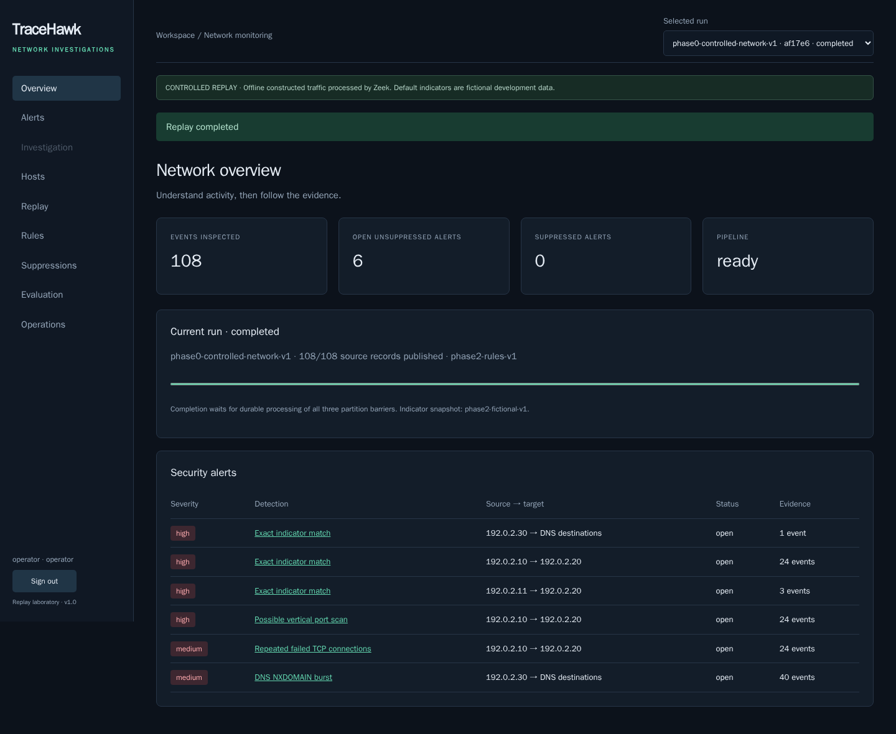
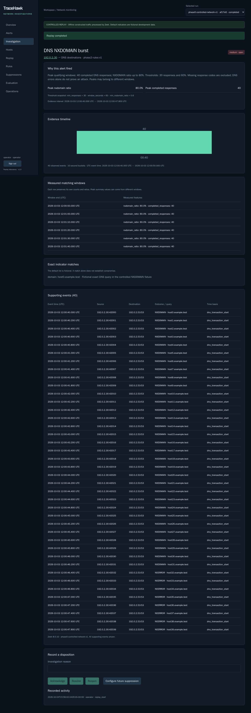
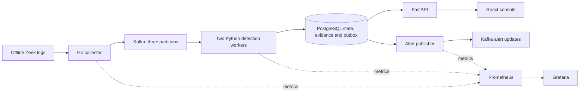

# TraceHawk

[](https://github.com/adineshreddy/TraceHawk/actions/workflows/phase1.yml)
[](https://github.com/adineshreddy/TraceHawk/actions/workflows/kubernetes.yml)

Distributed network security monitoring with explainable alerts and a replayable analyst workflow.

**Go → Kafka → two Python workers → PostgreSQL → React investigation console.** TraceHawk demonstrates source-partitioned processing, transactional recovery, evidence-backed detections and operational monitoring using original offline Zeek traffic. It is a local security laboratory; the demo traffic and indicator matches are fictional.



## Try the demo

Prerequisites: Python 3.10+, Docker with Compose v2, a running Docker daemon, approximately 4 GiB available Docker memory, and free ports 3100/3101. The first run downloads and builds pinned images. Tested locally on macOS ARM64; the linked workflows verify Linux on GitHub.

```sh
git clone https://github.com/adineshreddy/TraceHawk.git
cd TraceHawk
python3 tools/demo.py
```

Open **http://127.0.0.1:3100**. Sign in as `operator`, using the generated password in private `tmp/credentials.json`. Setup preserves existing data and credentials. Grafana is **http://127.0.0.1:3101/d/tracehawk-operations**, with the same initial operator password. Kafka, PostgreSQL and Prometheus have no host ports.

Choose **Replay → Controlled scan + DNS traffic → phase2-rules-v1 → 10× → Start replay**. Wait for completed: **108 events, six actionable alerts**. Filter Alerts to `dns_nxdomain_burst` and open its 40 supporting events. Run the benign scenario for **17 events and zero alerts**. Authorize the lab scanner before another controlled replay to retain one suppressed scan finding with its evidence.

[Recorded walkthrough](docs/phase-6/tracehawk-demo.webm) · [Five-minute narration script](docs/phase-6/demo-script.md) · [Setup, demo and reset runbook](docs/phase-6/README.md)

**[v1.0.0 release and demo download](https://github.com/adineshreddy/TraceHawk/releases/tag/v1.0.0)** · [Verified remote CI runs](docs/phase-6/ci.json)

## What it does

- Four configurable detectors: vertical TCP scans, repeated failed TCP connections, DNS NXDOMAIN bursts and exact fictional indicators.
- Explainable investigation: measured matching windows, contributing events, source host timelines, filters and audited dispositions.
- Historical-time suppression: authorized scans retain their finding and evidence while being excluded from actionable alerts.
- Distributed recovery: three Kafka partitions, two consumers, database checkpoint/ownership fencing and atomic event/state/alert/outbox writes.
- At-least-once alert delivery: stable update IDs and monotonic revisions support downstream deduplication.
- Operations: worker readiness, partition ownership, quarantine review, four Prometheus worker targets and ten provisioned Grafana panels.
- Local Kubernetes: dedicated kind deployment, enforced default-deny network policies, hardened application containers and retained-data recreation tests.



## Architecture



[Implemented architecture and boundaries](docs/phase-6/architecture.md) · [Contracts and OpenAPI](contracts/README.md) · [Detection semantics](docs/phase-0/detection-spec.md)

## Evidence and limits

| Evidence | Measured result | Scope |
|---|---|---|
| Controlled demo | 108 events, six alerts; benign 17 events, zero alerts | Two bundled synthetic scenarios |
| Recovery | Detection effects match uninterrupted replay after worker, broker and database interruptions | Local single-broker deployment |
| Short load trials | Approximately 38.4 durable events/s at 40 offered events/s | Twelve-second trials, two repeats; not maximum capacity |
| 500 events/s × ten-minute target | Failed early at the bounded backlog; acknowledged inputs drained | Sustained target was not achieved |
| ML experiments | Retrained baseline and temporal models added no held-out detections at selected cutoffs | Authored synthetic corpora; models remain offline |
| Kubernetes | Replay, enforced isolation, pod restart and retained-data cluster recreation tested | Local kind, retained hostPath; no HA or storage-loss recovery |

The Evaluation page shows frozen v1 results, including misses and false positives. The separate v2 ML experiment contains 82 fresh captures and 18,943 events, with complete validation tradeoffs and held-out scores. No real-world detection accuracy, live packet capture, deployed ML or cloud deployment is claimed. No LLM is required.

[Evaluation and load report](evaluation/reports/REPORT.md) · [ML v2 results](evaluation/experiments/ml-v2/REPORT.md) · [Recovery evidence](docs/phase-3/README.md) · [Kubernetes runbook](docs/phase-5/README.md) · [Two demo rehearsals](docs/phase-6/rehearsals.json)

## Development and verification

The GitHub workflows build the application, validate contracts, run unit/integration/browser checks, reproduce rule/model reports, and test Kubernetes deployment/recreation. Workflow status badges link to the actual runs. Local evidence is checked in; fresh remote reports are uploaded as workflow artifacts. Video authentication happens before recording, and private environment/password files are ignored.

[Detailed project plan](PROJECT_PLAN.md) · [Project resume bullets](docs/phase-6/resume-bullets.md) · [Threat model](docs/phase-0/threat-model.md) · [License and attribution](NOTICE.md)
