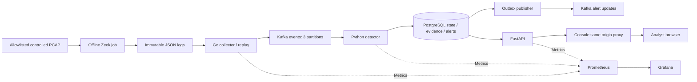

# Architecture and trust boundaries

## Ownership

Collector owns normalization, immutable file identity, source checkpoints, replay ordering/pacing and trusted completion controls. Detector owns deduplication, time windows, rule evaluation, event/evidence persistence and processing checkpoints. API owns schema migrations, sessions, management authorization and investigation queries. Outbox worker owns delivery of durable updates; it does not determine alert state.

One Python project can package API, detector and outbox entry points without combining their processes. Database schema changes have one migration owner. Shared domain helpers avoid divergent definitions.

## Topic routing

`tracehawk.events.v1`: key is canonical JSON `[scope_id, canonical_source_ip]`, UTF-8 without spaces. Use the Kafka Java-compatible positive Murmur2 hash modulo three partitions explicitly in Go; do not rely on different clients' defaults. IPv6 is canonicalized before hashing. Fix partition count and key algorithm per run.

`tracehawk.alerts.v1`: key alert ID; records include update ID and monotonic alert revision. `tracehawk.deadletters.v1`: bounded error metadata without arbitrary payload dumps. Topics initially have a 24-hour retention limit and 256 MiB per-partition byte limit; either can expire recovery history sooner. Check actual offset availability before resuming.

All initial temporal rules are local to a source IP and scope. Independent sensors observing the same traffic may duplicate observations; Phase 1 supports one sensor per run. Multi-sensor correlation/deduplication is deferred and must not be claimed.

## Proposed database entities

Events: unique scoped event ID, indexed source/time and destination/time, normalized typed detail. Alerts: unique deterministic ID, revision, status, evidence and rule version. State: per-scope/source/detector window information. Partition checkpoints: next offset, ownership epoch and scoped watermarks. Management: immutable rules/indicator versions, suppressions, sessions and append-only audits. Runs: durable replay jobs, manifest/rule snapshots, progress and terminal status. Outbox: unique update ID, delivery attempt metadata and bounded retention.

Persist events/state/checkpoint/alerts/outbox atomically. Foreign-key and uniqueness constraints enforce relationships. Evidence cap is 200 displayed IDs with total count and truncation flag. Store normalized events for seven days by default; cleanup must preserve referenced evidence or explicitly mark its expiry. These are configuration defaults, not storage-capacity claims.

## Process/network boundaries

Local default publishes console 127.0.0.1:3100. Optional API developer port is 127.0.0.1:8100. Monitoring publishes 127.0.0.1:9190 (Prometheus) and 127.0.0.1:3190 (Grafana). Core Kafka/PostgreSQL have no host ports. Phase 0's ephemeral compatibility probe alone uses 127.0.0.1:19092 and removes its broker afterward.

Zeek processing is a no-network, non-privileged one-shot job with read-only input. Browser requests reach private API through a same-origin proxy. API has no Docker socket and cannot execute user-selected commands or file paths. Replay accepts only allowlisted manifest IDs.

Metrics labels contain bounded detector/component/result enums. Avoid IPs, raw DNS names, event IDs or run IDs as Prometheus labels.

## Resource budget

Preflight observed 16 GiB host RAM, 10 CPUs and about 7.75 GiB Docker memory. Proposed limits: Kafka 1 GiB/2 CPUs, PostgreSQL 512 MiB/1 CPU, collector 256 MiB/1 CPU, detector 512 MiB/2 CPUs, API 256 MiB/1 CPU, console 256 MiB/1 CPU, Prometheus 256 MiB/1 CPU, Grafana 768 MiB/1 CPU. Zeek is sequential with a 512 MiB/1 CPU cap. Kubernetes and core Compose should not run together during benchmarks.

These are starting budgets; Phase 1 must verify startup and sustained use. Do not change Docker Desktop settings or stop unrelated services automatically.
