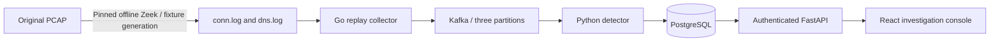

# Phase 1: working port-scan investigation

This report records the Phase 1 milestone and its regression checks. The current application is described in [Phase 2](../phase-2/README.md).

TraceHawk now replays actual Zeek JSON logs derived from the original offline PCAP, publishes normalized events through a Go collector and Kafka, detects port diversity in Python, and persists the investigation in PostgreSQL. The React console reads the authenticated API; its counts and evidence come from the running pipeline.



## Start locally

Prerequisite: Docker with Compose and about 2 GiB available for the core services. Builds and browser tests need additional temporary memory. Keep other project containers running if the Docker VM has room.

From the project root:

```sh
python3 tools/setup_dev.py
docker compose up -d --build --wait --wait-timeout 180
python3 tools/doctor.py
```

Open **http://127.0.0.1:3100**. Log in as `operator` with the generated password in `tmp/credentials.json`. The `analyst` account can investigate and record dispositions; replay and rule creation require `operator`. Both `.env` and the credential file are ignored, generated with private permissions, and preserved on repeated setup. No password is embedded in the application.

Only the console is published, on loopback. Kafka and PostgreSQL are private to the Compose network. This is a local development system with HTTP sessions and an internal bearer credential; deployment hardening belongs to later phases.

## Demo rehearsal: approximately two minutes

1. Sign in, open **Replay**, select **Controlled scan + DNS traffic**, and choose **10×**.
2. Start replay. Watch the overview reach **108 inspected events**, **completed**, and **one alert**. Completion waits for all three partition barriers to be processed durably.
3. Open **Possible vertical port scan**. Explain the **24 distinct ports** against the **20-port / 60-second threshold**, and inspect the **24 actual connections**. Time basis, Zeek provenance, immutable rule version and evidence interval are visible.
4. Enter an investigation reason, acknowledge the alert, and refresh. Show the persisted disposition and recorded activity.
5. Replay **Benign network baseline**. It contains **17 events** and produces **zero scan alerts** under the same rule snapshot.

Record the browser without the credential file visible. Saved screenshots are [overview](overview.png), [investigation](investigation.png), and [mobile investigation](mobile-investigation.png). These show the actual local application.

## Verification and evidence

Executed on this macOS ARM64 host with Linux ARM64 application containers:

| Check | Actual result | Report |
|---|---|---|
| Fresh data volumes and migrations | Compose startup and readiness succeeded; reset/recreate preserves credentials | Startup commands above |
| Go normalization | All 108 records match the Phase 0 Python fixture, excluding ingestion/publication clock values; decimal half-even rounding, Murmur2 vectors, partial lines and changed sources checked | `services/collector/main_test.go` |
| Scan replay | 108 unique events, one alert, 24 distinct ports and evidence rows | [API verification](api-verification.json) |
| Benign replay | 17 events, zero alerts | [API verification](api-verification.json) |
| Detector restart during partial window | Restart after 10 events; final 108 events and one alert with 24 evidence rows | [API verification](api-verification.json) |
| Collector crash after Kafka ACK | One persisted event with source checkpoint still zero; restart/lease recovery reaches 108 unique events and one alert | [Collector recovery](collector-recovery.json) |
| Transaction integrity | Production SQL window boundaries, unique-port counting, protocol/state/source grouping; event/state/offset and alert/evidence/outbox rollback; duplicate re-delivery; late event and invalid barrier behavior | [Transaction report](transaction-verification.json) |
| Access controls | Anonymous/role/origin/CSRF/body-size checks; authenticated outsider cannot read another workspace's runs, overview, alerts or evidence; logout; cancellation retains partial evidence | [API verification](api-verification.json) |
| Browser flow | Chromium login, real replay, evidence, disposition, refresh, text escaping, mobile width, logout and analyst permissions | [Browser report](browser-verification.json) |
| API contracts | Actual integration responses validated against OpenAPI schemas; canonical event/alert schema validation | [OpenAPI](../../contracts/openapi.json), API verification script |

To repeat these checks:

```sh
python3 -m venv .venv
.venv/bin/python -m pip install --require-hashes -r services/backend/requirements.lock
.venv/bin/python -m pip install -r contracts/requirements-phase0.lock.txt
.venv/bin/python tools/validate_contracts.py
go -C tools/compatibility run ./cmd/contracts
go -C services/collector test ./...
APP_ROOT="$PWD" PYTHONPATH=services/backend .venv/bin/python -m pytest services/backend/tests -q
PLAYWRIGHT_SKIP_BROWSER_DOWNLOAD=1 npm --prefix services/console ci --ignore-scripts --no-audit --no-fund
npm --prefix services/console run build
.venv/bin/python tools/verify_phase1.py
docker compose exec -T api python - < tools/verify_transactions.py > docs/phase-1/transaction-verification.json
.venv/bin/python tools/verify_collector_recovery.py
tools/verify_browser.sh
```

On this Mac, pip downloads require `PIP_CERT=/etc/ssl/cert.pem`; certificate verification stays enabled. The browser helper runs pinned Chromium in an isolated container with a local test proxy, preserving the application's required origin. Run pipeline checks sequentially when no user replay is active. They create their own replay runs, restart TraceHawk workers, and write reports. The collector crash helper clears only its private fault marker and restores normal configuration afterward. Database mutation tests roll back their test data and checkpoint changes.

The GitHub workflow in `.github/workflows/phase1.yml` covers the same checks. It is configured for an Ubuntu runner; GitHub-hosted execution has not occurred in this local-only session.

## Implementation decisions

- Three Kafka partitions retain the planned Java Murmur2 source/scope key assignment. The Phase 1 detector statically owns all three and takes a PostgreSQL singleton advisory lock.
- PostgreSQL is authoritative for consumer progress. Events, time state, evidence, alert revisions, outbox updates and offsets commit in one transaction. After restart the detector seeks to database offsets; Kafka commits are secondary.
- The collector checkpoints only acknowledged records. Stable source-offset identities deduplicate re-delivery after a crash. Its generation lease prevents stale completion barriers from finishing a newer attempt.
- Window intervals are `[end − 60s, end)`, evaluated every 10s, with 30s event-time lateness. An event at/before the existing watermark remains stored but cannot contribute to temporal features. Only trusted fixture completion markers advance idle partitions to the final watermark.
- Rule versions are immutable. Scan alerts use deterministic scope/rule/source/destination/five-minute bucket IDs, union unique evidence, and retain the maximum observed distinct-port count across matching windows.
- API-owned checksum migrations and direct psycopg transactions keep this first slice explicit. SQLAlchemy/Alembic from the feasibility probe are not runtime dependencies. Applied migration files must not be edited; introduce a new numbered SQL migration instead.
- Bad envelopes/control records are quarantined in PostgreSQL and make pipeline health degraded. Database/state/retention errors stop the consumer and restart from durable progress rather than continuing past a failed transaction. Cancellation skips queued records while retaining already accepted evidence.

## Boundaries and next phase

Only **vertical TCP port-scan detection** is enabled. Failed-connection, DNS and indicator rules remain disabled until Phase 2; enabling them is rejected by the API. No LLM, anomaly model, live packet capture, automatic blocking, multi-consumer rebalance, broker redundancy, Kubernetes or cloud deployment is claimed.

This phase replays checked-in Zeek logs; replay does not rerun Zeek or accept arbitrary PCAP uploads. Regenerate the original capture/logs with the Phase 0 tools, and the benign fixture with `tools/prepare_phase1_scenarios.py`. Capture ground-truth labels stay outside runtime event envelopes and are not detector inputs.

Alert updates have a transactional outbox in PostgreSQL. Delivery to the alerts Kafka topic and dead-letter streaming are Phase 3 work. Fixed alert buckets can split a sustained incident. The tiny controlled and benign fixtures demonstrate behavior; they do not establish accuracy, false-positive rates or throughput.

Phase 2 adds the remaining detectors, host investigation, timelines, filters and scoped suppression. Later phases establish operational and evaluation evidence for resume claims.

## Stop, reset and troubleshoot

```sh
docker compose stop
# Restart existing data:
docker compose up -d --wait
# Delete ONLY TraceHawk local data; credentials are preserved:
python3 tools/reset_dev.py --confirm-tracehawk-data-reset
```

No command above stops SentinelLLM or performs a global Docker prune. Reset deletes TraceHawk runs, evidence, alerts, broker history and its fault marker. Without the explicit reset flag the helper refuses to run.

Use `python3 tools/doctor.py` and `docker compose logs --tail=50 api collector detector kafka` for failures. A replay interrupted by a collector crash resumes after the 30-second lease expires. If required Kafka offsets have expired, the detector deliberately stays degraded rather than silently skipping history. If local credentials are changed, existing database users retain their original hashes until an explicit password-management feature or local data reset is used.
