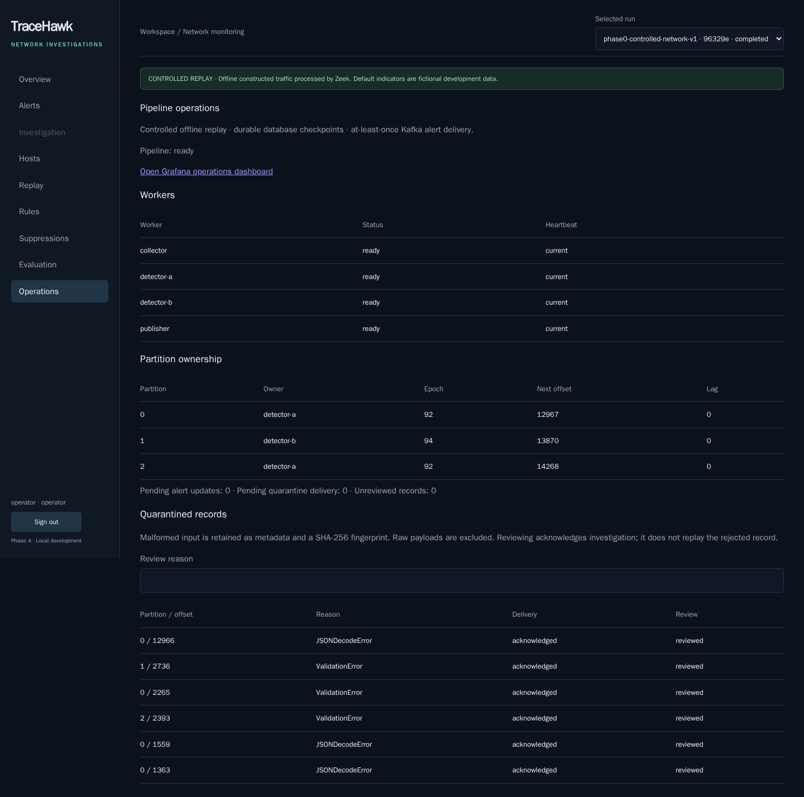
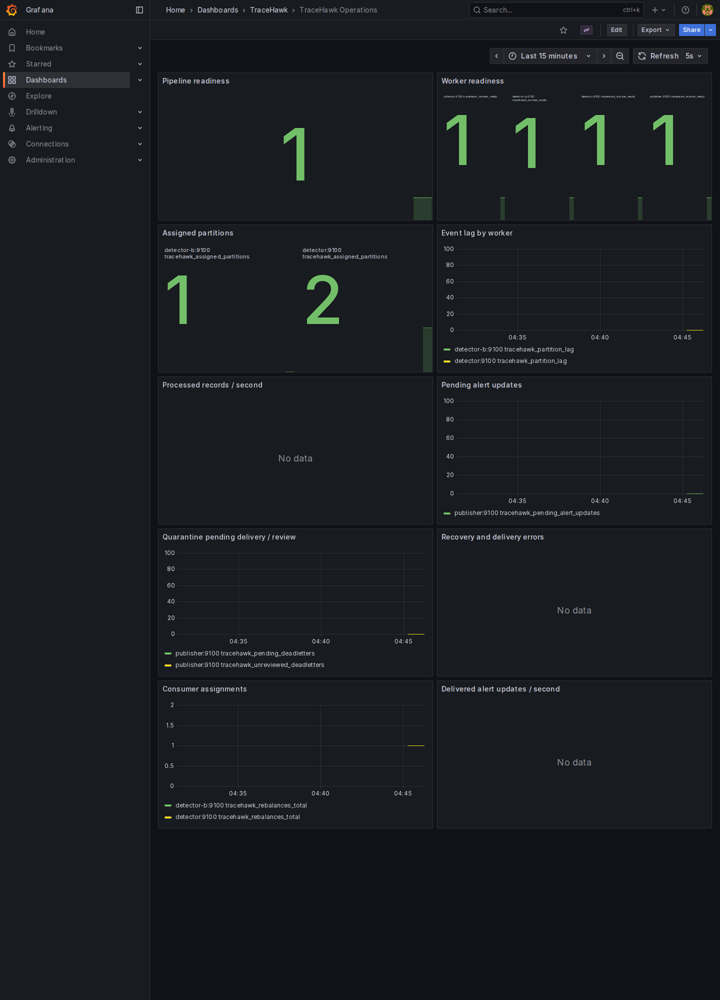

# Phase 3 — Reliability and operations

TraceHawk now runs two Python detector workers in a real Kafka consumer group, publishes persisted alert revisions and quarantined-record metadata, and provides an operator Operations page plus a provisioned Grafana dashboard.

## Run and demonstrate

```sh
python3 tools/setup_dev.py
docker compose up -d --build --wait --wait-timeout 180
python3 tools/doctor.py
```

- Console: http://127.0.0.1:3100 — sign in as `operator`, start the controlled replay with `phase2-rules-v1`, and open **Operations**.
- Grafana: http://127.0.0.1:3101/d/tracehawk-operations — separate login, user `operator`, same initial generated operator password in the ignored `tmp/credentials.json`. Grafana persists its account; changing the environment password later does not rotate an existing Grafana account.
- Replay produces 108 events and six alerts; the benign fixture produces 17 events and no alerts.
- The Operations page shows actual workers, partition owners/epochs, durable offsets, lag, delivery queues and reviewed quarantine metadata. Analysts cannot access these operator endpoints.
- Grafana has ten provisioned panels sourced from Prometheus: readiness, assignments, lag, processing rate, delivery queues, quarantines, errors, rebalances and delivery rate.

Kafka, PostgreSQL, Prometheus and worker probe ports remain internal. Only the console and authenticated Grafana bind host loopback. These are development credentials and local HTTP endpoints.





## Recovery design

The group uses the explicitly configured classic protocol and eager round-robin assignor. Assignment callbacks lock each checkpoint, increment its ownership epoch, store a unique process owner and seek the **PostgreSQL next offset**, after checking broker retention bounds. A new worker reads persisted events, windows and rules rather than rebuilding from an in-memory cache.

Each detection transaction locks the partition checkpoint and verifies both epoch and owner before any writes. Event insertion, alert/evidence/window changes, outbox insertion and next offset commit together. Kafka offset commits happen afterward and are advisory for recovery. Revocation clears only the matching owner and increments the fence. SIGKILL leaves ownership until the group reassigns it; the new epoch prevents stale writes after reassignment. A transaction already holding the checkpoint lock can finish before the new owner acquires that lock. This is database fencing, not a claim that Kafka revocation can undo an already committed transaction.

Database calls have a three-second connection timeout, three-second lock timeout and five-second statement timeout. Dependency errors abandon the consumer session; the process reports paused readiness, retries and reloads the database checkpoint. No processing continues past the failed transaction. Kafka history missing below the saved offset pauses the worker instead of silently resetting to latest.

One alert publisher selects undelivered outbox rows under transaction locks and an advisory transaction lock, sends to Kafka, waits for the broker acknowledgment, then marks the row delivered. Alert messages use `alert_id` as the Kafka key, with `schema_version`, `update_id`, `alert_id`, `revision` and the canonical `alert` in the value. Revisions for an alert go to the same partition. Publication is **at least once**: a crash after Kafka ACK but before the database commit can repeat an update. Consumers must deduplicate by `update_id` and retain the greatest `revision` per `alert_id`. The verifier demonstrates both behaviors; there is no downstream production sink yet. This is not end-to-end exactly-once delivery.

Rejected input advances the input checkpoint only in the same transaction as its quarantine record. The dead-letter publisher emits `schema_version`, `deadletter_id`, `source_topic`, partition, broker offset, reason class, byte count and SHA-256 fingerprint to `tracehawk.deadletters.v1`. The stable ID hashes `[source_topic, partition, offset]`. Payload bodies and exception text are deliberately excluded from this operational record and logs. Original input remains subject to Kafka's retention limit; metadata is not enough to reconstruct it. An audited operator review acknowledges investigation and restores quarantine health; it does not replay a rejected record or hide the record.

## Backpressure and probes

Consumer prefetch is bounded to approximately 1 MiB per worker (a single record may exceed a fetch setting); the collector producer buffers at most 100 records / 1 MiB and uses five-second delivery deadlines. The outbox producer buffers at most 100 messages / 1 MiB and delivers one alert and one quarantine record per database transaction. The API stops issuing new replay leases when consumer coverage is missing or at least 1,000 alert updates await publication. An already admitted replay may finish publishing its bounded fixture. This is admission backpressure for the two bundled replay sources, not a tested unbounded live-ingestion controller.

API `/health/live` is independent of PostgreSQL; `/health/ready` checks PostgreSQL. Collector and Python worker `:9100/health/live` endpoints check main-loop freshness; `/health/ready` requires active ready state. Database/broker outages produce paused readiness while the process remains live during retry. Python probe freshness and database component heartbeats expire after 15 seconds; the collector probe allows 20 seconds for its bounded replay/HTTP loop. The pipeline requires both configured detectors, collector and publisher, three fresh partition owners matching current worker identities, and no unreviewed quarantines. One detector can continue processing all partitions while overall health indicates degraded redundancy.

Worker `/metrics` exposes low-cardinality process counters and gauges. Counters reset on restart; use `rate()`/`increase()` for counters. Lag is the latest successfully sampled broker high offset minus the database checkpoint; an outage makes the sample stale rather than inventing a fresh broker offset. Prometheus scrapes every five seconds, with 24-hour / 128 MiB retention. Application logs are JSON metadata; underlying Kafka/Grafana/PostgreSQL diagnostics have their own formats.

The Compose service limits total roughly 2.63 GiB excluding the transient topic initializer and browser verifier. Actual load depends on use. The stack remains one Kafka broker and one PostgreSQL instance, with replication factor one. Restart recovery depends on intact local Docker volumes and retained input (24 hours or 256 MiB per partition, whichever expires first). Kubernetes, high availability, large-load testing and accuracy evaluation are later phases.

## Verification

```sh
.venv/bin/python tools/verify_phase3.py
tools/verify_browser.sh phase3
.venv/bin/python tools/verify_phase1.py
.venv/bin/python tools/verify_phase2.py
docker compose exec -T api python - < tools/verify_phase3_delivery.py
docker compose exec -T api python - < tools/verify_phase3_backpressure.py
docker compose exec -T api python - < tools/verify_transactions.py
docker compose exec -T api python - < tools/verify_phase2_semantics.py
python3 tools/verify_phase2_migrations.py
```

The Phase 3 verifier interrupts **only this project's services**, restores them in `finally`, creates real additional replay runs, publishes one intentionally malformed record and records its operator review, and changes one test alert to acknowledged. It does not delete existing application data. The publisher crash hook is an ignored private-volume file targeting one update ID; it is consumed once before exit code 17, immediately after ACK and before the SQL delivery mark.

Recovery comparisons preserve normalized event content/eligibility, alert metrics/thresholds/severity/suppression, exact provenance-based evidence, matching windows and source finalization state. They exclude run/alert/event IDs, ingestion/publication wall time, process ownership and physical partition placement: replay scopes intentionally affect partition routing. All three completion barriers must match the current producer generation.

Evidence: [verification summary](verification.json), [recovery report](recovery.json), [semantic regressions](semantics.json), [browser report](browser.json), [outbox admission backpressure](backpressure.json), [published record contracts](delivery.json). CI includes these checks but remote GitHub execution is not claimed.

## Technical references

- [Confluent Python consumer assignment/revocation APIs](https://docs.confluent.io/platform/current/clients/confluent-kafka-python/html/index.html)
- [Prometheus scrape configuration](https://prometheus.io/docs/prometheus/latest/configuration/configuration/)
- [Grafana data source and dashboard provisioning](https://grafana.com/docs/grafana/latest/administration/provisioning/)
