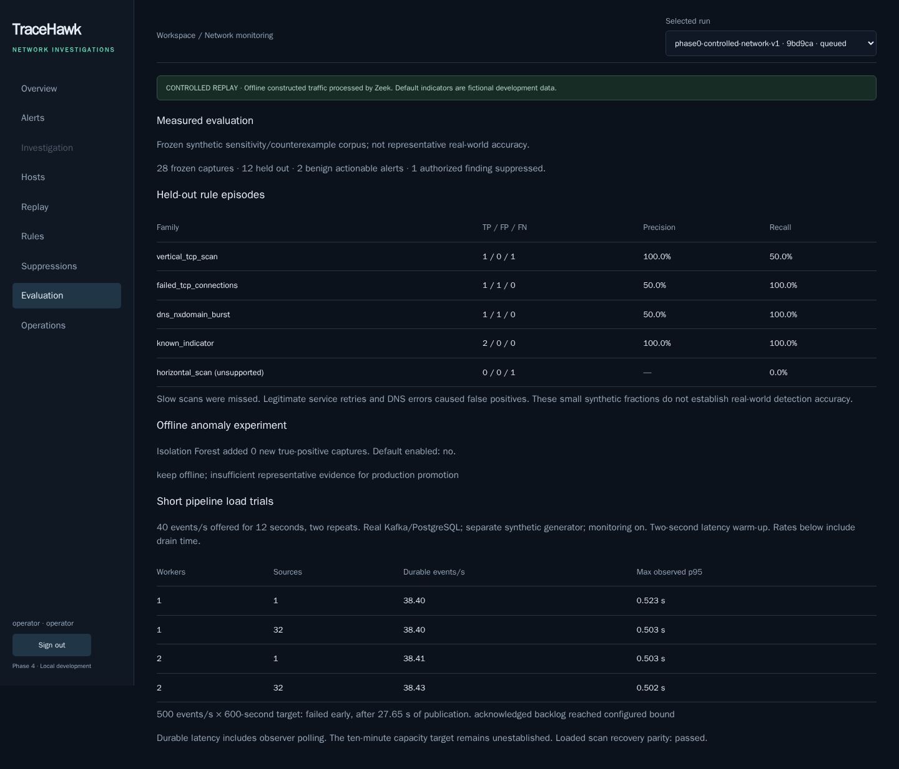

# Phase 4 — Evaluation and ML

TraceHawk now includes a frozen synthetic evaluation corpus, production-rule evaluation, an offline Isolation Forest experiment, real pipeline load/recovery measurements, and an authenticated **Evaluation** page. Open http://127.0.0.1:3100 and select Evaluation after signing in.

The [measured report](../../evaluation/reports/REPORT.md) retains the false positives, slow-scan miss and unsupported horizontal scan. Small synthetic fractions describe these examples; they do not establish production accuracy. The optional model added no new true positives and remains offline. No LLM is required.



## Frozen inputs and measurements

The original corpus has 28 PCAPs processed by pinned Zeek 8.0.10: ten benign training captures, six development-validation captures and twelve held-out captures with distinct source addresses. PCAPs, actual Zeek logs, manifests, labels and protocol hashes are included under [evaluation/corpus](../../evaluation/corpus). Labels stay separate from collector jobs and canonical events. Hash changes fail verification rather than silently updating the freeze.

Actual Go normalization feeds unchanged `phase2-rules-v1` into the production PostgreSQL event/window/alert implementation. Each capture runs in a rolled-back transaction inside a disposable private database. A frozen maximum one-to-one episode matcher compares family, source, destination and time overlap. Authorized scanner policy is installed before processing; suppressed evidence is reported separately.

The exported [JSON model](../../evaluation/model/isolation-forest-v1.json) contains tree data and the feature contract, without a pickle. Training uses only benign training windows; validation benign scores select the strict cutoff. Held-out results do not select the cutoff or modify rules. A source/five-minute-episode comparison evaluates rules, ML and their union consistently, including horizontal scans. It collapses same-source indicator families and therefore differs from the per-family rule table. Runtime detectors do not load the artifact or depend on scikit-learn. See the [Isolation Forest documentation](https://scikit-learn.org/stable/modules/generated/sklearn.ensemble.IsolationForest.html) for the estimator; an anomaly score is not an attack probability.

The [benchmark](../../evaluation/reports/benchmark.json) runs real Kafka/PostgreSQL consumers with monitoring on. Its direct synthetic producer bypasses Go replay and HTTP admission, so these measurements do not establish collector or PCAP throughput. Eight repeated short trials offer 40 events/s for twelve seconds, comparing one/two workers and one/32 sources. Including drain, measured durable rates were 38.40–38.43 events/s. This offered load does not identify maximum capacity or demonstrate scaling benefits.

The 500 events/s × ten-minute engineering target **failed early** after 27.65 seconds: acknowledged backlog reached the configured 3,000-event stopping bound. All 13,825 acknowledged events subsequently persisted, with a 14.12-second drain after publication stopped. The observed peak backlog was 3,070 because the threshold is checked between batches. Loaded durable-observation p95 reached 12.88 seconds. Producer acknowledgment minus observed committed receipts measures workload backlog; it is not a sampled Kafka broker-high-offset lag metric. Broker lag remains available in the Phase 3 operational dashboards. The report's `status: passed` means the measurement/count/parity assertions passed, while `engineering_target.completed: false` records the capacity failure.

Insertion timestamps are taken inside event transactions. Polling committed receipts provides an upper-bound durable-observation delay; insertion clocks provide a lower bound, not commit timestamps. Roughly 0.5-second polling delay is included in observed p50/p95/p99. Migration 004 writes receipts in the same transaction as each unique event; rollback and duplicate-delivery tests verify their atomicity. Its overhead is included in these measurements. There is no receipt-pruning policy yet.

A separate 480-event scan replay under worker SIGKILL/restart matched the uninterrupted reference's event count, time/source/destination/port projection hash, and alert observed metrics/evidence counts. This is effect comparison, not byte equality of run-specific alert/event identities. The short disk calibration records whole-database growth (122,880 bytes over sixty events), including background writes; it does not estimate per-event storage cost. Host/Docker limits and CPU/memory snapshots are included in the benchmark. No cloud, high-availability or sustained-capacity claim follows from local recovery.

## Reproduce

Use the existing setup instructions and start this project's stack first. The frozen corpus is already included; PCAP/Zeek regeneration is unnecessary for evaluation.

```sh
# Use the project virtual environment created during Phase 0.
PIP_CERT=/etc/ssl/cert.pem .venv/bin/python -m pip install --require-hashes -r evaluation/requirements.lock
.venv/bin/python tools/prepare_evaluation.py
.venv/bin/python tools/run_evaluation.py
.venv/bin/python tools/evaluate_ml.py
.venv/bin/python tools/render_evaluation_report.py
```

`prepare_evaluation.py` builds the actual Go collector's local-only normalization mode, verifies input/output hashes and checks Go/Python partition routing parity. `run_evaluation.py` uses private temporary credentials and removes its disposable database. `evaluate_ml.py` exports the seeded model and verifies JSON score parity against scikit-learn. [Reproducibility evidence](reproducibility.json) records identical regenerated rule/ML reports. Reprocessing the original PCAP with Zeek may generate different UIDs; the actual logs are frozen.

To repeat the real load/recovery measurements on an idle TraceHawk stack:

```sh
.venv/bin/python tools/benchmark_phase4.py
.venv/bin/python tools/render_evaluation_report.py
.venv/bin/python tools/update_phase4_openapi.py
# Package the resulting research summary in the API image.
docker compose build api
docker compose up -d --wait api detector detector-b publisher
tools/verify_browser.sh phase4
```

The benchmark temporarily stops/restarts only this project's detector workers and restores both in its cleanup path. It retains measured run data in the benchmark workspace. Do not run other replay/fault verifiers simultaneously. Live timing/resource results will vary; frozen detection inputs and seeded model results are reproducible. The full manual capacity attempt is not a CI performance gate. CI runs frozen evaluation plus browser and existing recovery checks; remote CI has not been executed for this unpublished repository.

## Verification and remaining work

[Browser evidence](browser.json) covers authenticated results, operator/analyst access, real data tables, desktop/mobile layout, and three completed real-replay visibility samples. The maximum observed creation-to-visible delay was 2.44 seconds. This includes pre-commit alert creation, polling/scheduling and cross-container clock uncertainty; three samples establish no percentile or production SLA.

[API/contract evidence](api.json) verifies both roles, denied anonymous access, source report references and model hashes. [Transaction evidence](transactions.json) covers receipt rollback/deduplication alongside event/alert/checkpoint invariants. Fresh migrations 001–004, thirteen Python tests, Go tests, seven schemas with 28 cases, actual API response parity and the existing four-detector integration verifier passed locally. Phase 3 recovery is rerun on the instrumented backend; see its linked evidence.

The next planned phase is **Phase 5: deployment and hardening**. Kubernetes and the final portfolio/video release are not implemented in this phase. Better held-out datasets, broader benign exposure, horizontal/slow-scan coverage, retention and higher-load capacity work remain explicit future improvements.
