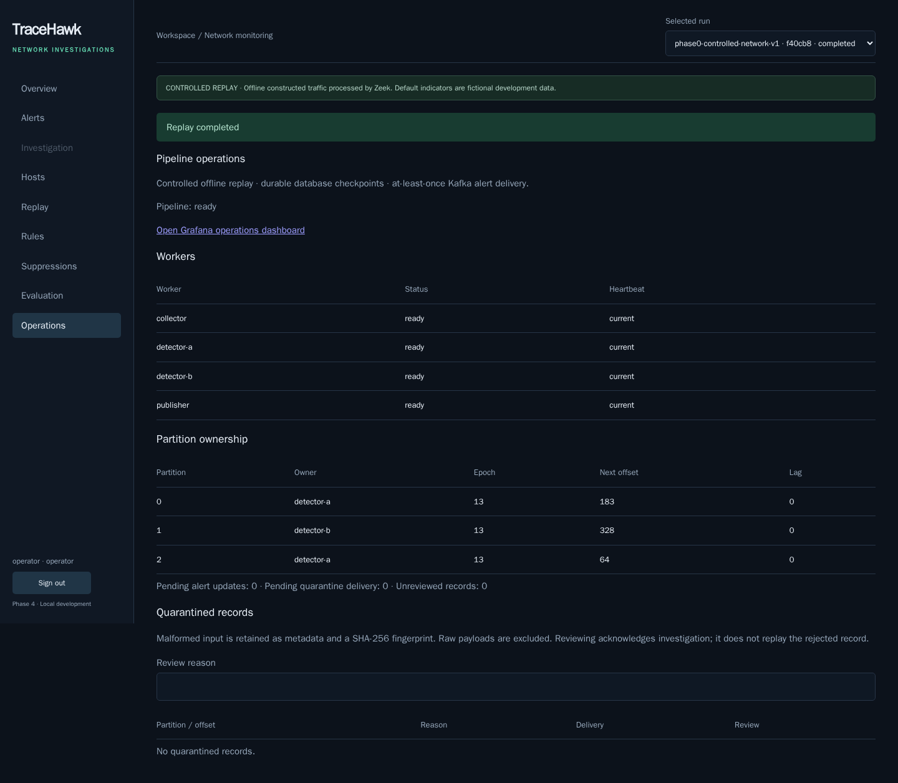

# Phase 5 — Deployment and hardening

TraceHawk runs in a dedicated local kind cluster using the same application images as Compose. The pinned node version and ARM64 support come from the [kind v0.31.0 release](https://github.com/kubernetes-sigs/kind/releases/tag/v0.31.0). Real replay, enforced network isolation, pod replacement and cluster recreation have passed locally. The [verification report](kubernetes.json), [isolation report](isolation.json), [monitoring report](monitoring.json) and [browser report](browser.json) contain the evidence. This is local Kubernetes experience; cloud deployment and high availability have not been demonstrated.



## Start and review

Requirements: Docker, the project virtual environment, and kubectl compatible with Kubernetes 1.35 (client minors 1.34–1.36). On this Mac, the tested kubectl client is 1.36.1. The helper downloads a checksum-pinned kind binary into the ignored workspace directory, without installing global tools or changing your default kubeconfig.

```sh
python3 tools/setup_dev.py
# Backend and Phase 0 verification dependencies include PyYAML/httpx.
.venv/bin/python tools/check_kubernetes.py
.venv/bin/python tools/kubernetes.py up
.venv/bin/python tools/kubernetes.py forward
```

Keep the forwarding command running. Open http://127.0.0.1:3102 for the console and http://127.0.0.1:3103/d/tracehawk-operations for Grafana. Sign in as `operator` with the private Kubernetes password in `tmp/kubernetes-credentials.json`. These credentials and data are separate from Compose. The console's public runtime configuration supplies the correct Grafana link for each deployment.

Start the controlled replay with `phase2-rules-v1`: 108 events and six evidence-backed alerts. The benign scenario produces seventeen events and zero alerts. Operations shows both detector owners, lag and delivery queues. Evaluation retains the Phase 4 measured limitations and disabled offline model. Four actual worker metrics targets and ten provisioned Grafana panels are verified.

`up` stops only this project's Compose services to keep memory use bounded. It retains their volumes and leaves other projects running. Kubernetes uses `tmp/kind-kubeconfig`, `tmp/kubernetes-secrets.env` and `tmp/kind-data`; do not replace its kubeconfig with another cluster's context. Existing-node operations require a matching cluster label and exact host data mount. Files with credentials/kubeconfig are private and ignored by the repository.

## What is hardened

The [51 reviewed resources](../../infrastructure/kubernetes/resources.yaml) include a Restricted-admission namespace, a service account with no workload API grants, resource requests/limits and quota, ten private services, readiness/liveness/startup probes, six static persistent volumes/claims, topic initialization, configuration maps and thirteen network policies.

Every application/database/monitoring container runs non-root with RuntimeDefault seccomp, all capabilities dropped, no privilege escalation, and a read-only root filesystem. The namespace enforces the [Kubernetes Restricted standard](https://kubernetes.io/docs/concepts/security/pod-security-standards/). Explicit volumes provide writable data/socket/temp paths. Service-account tokens are disabled. Kafka's generated config and transient logging live in writable volumes; its data remains persistent. Calico/control-plane components require privileged host access in their infrastructure namespaces; the application namespace is not a cluster-admin boundary.

Default-deny policies cover both directions, using [Kubernetes NetworkPolicy](https://kubernetes.io/docs/concepts/services-networking/network-policies/) enforced by the [Calico CNI](https://docs.tigera.io/calico/latest/getting-started/kubernetes/kind). Namespace-and-application selectors allow only required connections, plus cluster DNS. Actual tests establish API→PostgreSQL connectivity, deny API→Kafka and console→PostgreSQL, and deny API ingress from a different namespace even when it copies the console label. DNS resolution is asserted before denied connection attempts. The user-facing console path, collector, detection, publication and Grafana queries verify their permitted paths in use.

Kafka has a headless internal service with not-ready addresses published, allowing its single controller to initialize before readiness. PostgreSQL, Kafka, metrics and worker probes have no host/service external ports. Local access uses `kubectl port-forward --address 127.0.0.1`; a trusted cluster administrator can forward other services too. No ingress controller or public endpoint is installed.

Secrets are generated into private ignored files and applied through a Kubernetes Secret without logging their values. Workers receive only the database credential, the collector receives the internal token, and the API receives login/internal/database values. Grafana receives only its initial administrator credential. Kubernetes Secret encoding is not encryption; this local kind profile does not configure etcd encryption, an external secret manager, TLS/SASL between services, or separate least-privilege database roles. The cluster administrator and local host are trusted. The database credential remains the existing development database-owner/bootstrap credential; non-root OS execution does not reduce its SQL permissions.

## Resource and storage boundaries

The tested host is Apple M5 ARM64 with 16 GiB physical memory; Docker provides ten CPUs and about 7.75 GiB. The dedicated node is capped at 4 GiB without swap. The [runtime evidence](runtime.json) records versions, pod images and an after-test resource snapshot; it is not a load benchmark. Application pod memory limits total 2,688 MiB, excluding the temporary 384 MiB topic job and CNI/control-plane overhead. Requests are lower than limits; quota allows 3 GiB of application pod memory limits and twelve CPU limits. These budgets are for the small replay profile, not evidence of capacity at the failed Phase 4 load target.

PostgreSQL, Kafka, collector/publisher state, Prometheus and Grafana use host-retained storage under `tmp/kind-data`. Each static PV declares 2 GiB and uses Retain, but **hostPath does not enforce that capacity**. Monitor actual host/Docker disk use. Kafka's input history remains bounded by 24-hour/256-MiB-per-partition retention; Prometheus keeps 24 hours/128 MiB. PostgreSQL event, receipt and audit retention/pruning is not implemented. Preserve the entire host directory and private credential files when preserving this local instance; these are not tested portable backups.

Deleting a pod preserves its PVC data. Deleting/recreating this dedicated kind cluster also preserves the host directory; Kubernetes objects and the node's internal system state are rebuilt. The verifier checks a different node UID, retained completed runs/evidence/login credentials and a new successful replay. Losing the host directory, changing credentials inconsistently, or expiring required Kafka history is outside that recovery result. Do not manually delete the namespace/PVCs and expect Released PVs to rebind automatically; use the tested whole-cluster helper procedure.

## Verification and recovery commands

Stop any interactive forwarding command before these verifiers. Run replay/fault verifiers serially.

```sh
.venv/bin/python tools/verify_kubernetes.py --recreate
.venv/bin/python tools/verify_kubernetes_monitoring.py
.venv/bin/python tools/verify_kubernetes_browser.py
```

The recreation verifier deletes only the checked dedicated cluster, rebuilds it from the reviewed manifests and preserves host-mounted files. It compares normalized event bodies/eligibility, matching-window measurements, alert values and evidence provenance after worker restart and stateful pod replacement. Run-specific IDs and arrival clocks are excluded from cross-run comparisons. Every test replay has 108 unique receipts/events and six alerts. This does not demonstrate exactly-once broker delivery, failover or loss of the storage host.

For ordinary restart diagnosis, use the explicit private kubeconfig:

```sh
kubectl --kubeconfig tmp/kind-kubeconfig -n tracehawk get pods
kubectl --kubeconfig tmp/kind-kubeconfig -n tracehawk logs deployment/detector --tail=30
kubectl --kubeconfig tmp/kind-kubeconfig -n tracehawk rollout restart deployment/detector
kubectl --kubeconfig tmp/kind-kubeconfig -n tracehawk rollout status deployment/detector
.venv/bin/python tools/kubernetes.py status
```

A broken stateful configuration may require replacing its unready pod after fixing the manifest: StatefulSet ordered updates can wait for the old pod to become ready. Existing Grafana accounts and API users keep their stored password hashes; changing environment values alone does not rotate them. Restart interrupted port-forwards after pod replacement.

To pause Kubernetes and restore the usual Compose demo:

```sh
.venv/bin/python tools/kubernetes.py pause
docker compose up -d --wait --wait-timeout 180
python3 tools/doctor.py
```

To remove the dedicated cluster while retaining its data, use `.venv/bin/python tools/kubernetes.py down`. `up` recreates it or resumes the paused dedicated node. No global Docker prune, other cluster changes or deletion of Compose volumes is performed.

## CI and next phase

[The Kubernetes workflow](../../.github/workflows/kubernetes.yml) checks deployment inputs, builds the same images, validates against a real API server, runs replay/isolation/replacement/recreation checks and verifies monitoring/browser behavior. Its cleanup targets only the dedicated test cluster. This repository is unpublished, so remote CI has not run and branch protection has not been configured. The Linux/AMD64 workflow remains pending remote execution; the complete local run is macOS/ARM64.

[ADR 0005](../decisions/0005-local-kubernetes.md) records the storage and networking decisions. Next is **Phase 6: presentation and portfolio release**—final demo polish, clean rehearsals, video script/recording and resume claims grounded in the evidence.
