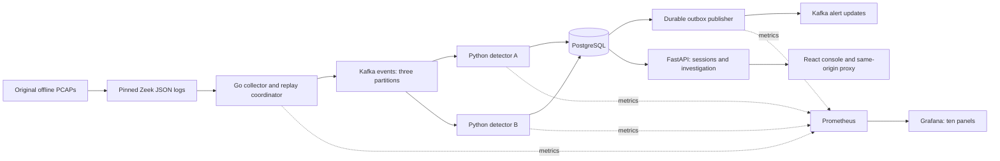

# Implemented architecture

The demo replays two allowlisted, originally constructed offline scenarios. This release does not capture live interfaces or accept arbitrary PCAP uploads. Zeek analysis runs offline; the Go collector normalizes its logs, validates contracts, preserves provenance and routes each source/scope consistently to one of three Kafka partitions. Two consumers demonstrate distributed ownership; a third partition can share a worker.

Detectors evaluate source-local sliding event-time windows. A database transaction persists the event, window state, alert/evidence, delivery outbox and checkpoint together. Ownership epochs and a process owner fence stale consumers. Replay completion is a trusted, per-partition control, allowing final windows to finish without silently dropping tail events. Recovery comparisons check complete detection effects against uninterrupted runs.

The publisher waits for Kafka acknowledgement before marking an outbox update delivered. A crash between those operations can publish a duplicate. Stable update IDs and monotonic revisions support downstream deduplication; delivery is explicitly at least once.

The API provides operator/analyst sessions, role checks, CSRF protection, scoped reads, immutable rule/indicator versions, audited dispositions and historical-time suppressions. Suppression retains the alert and evidence. There is no LLM in the detection path. The two Isolation Forest experiments remain offline because useful additional held-out coverage was not demonstrated by the retrained models.

Local Compose publishes only console `127.0.0.1:3100` and Grafana `127.0.0.1:3101`. PostgreSQL, Kafka and Prometheus are internal. Kubernetes uses a dedicated single-node kind cluster, default-deny Calico policies, restricted application containers and retained local host storage. Operator port-forwarding exposes console/Grafana on 3102/3103. This is a tested local deployment, with no HA, cloud deployment, TLS/SASL, portable backup, SQL least-privilege role or storage-loss recovery claim. Retained hostPath volume sizes do not enforce disk limits. Event/receipt cleanup is not implemented; monitor disk use and reset laboratory data explicitly when needed.

See [network and storage boundaries](../phase-5/README.md), [distributed recovery evidence](../phase-3/README.md), [measurement protocol](../../evaluation/PROTOCOL.md), and [wire contracts](../../contracts/README.md). The phase-0 architecture document records initial design proposals; this document describes the shipped implementation.
